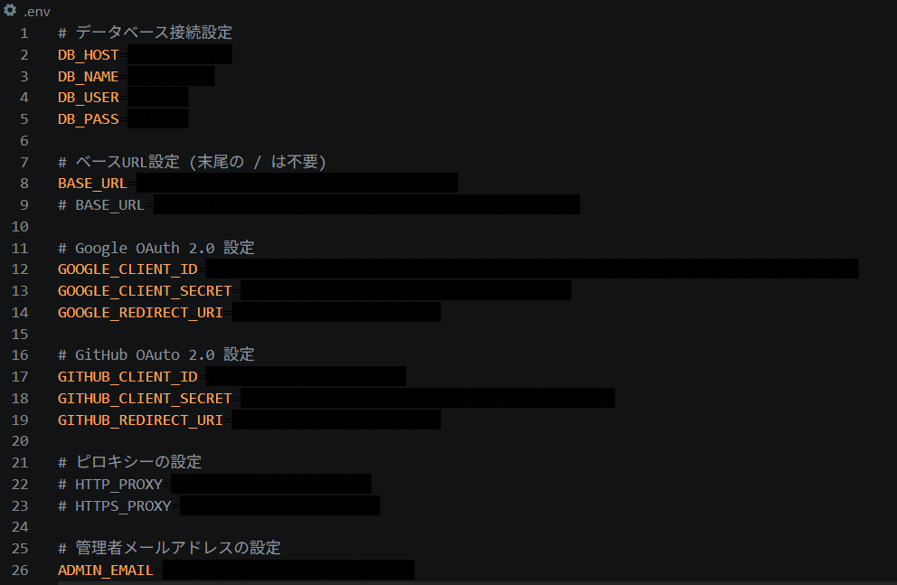

# README

サーバーサイドプログラミングの最終課題  
GE3A 37 松田 昊

## 制作物の概要

ポイント管理システムを作りました。  
将来的に、チーム制作でメンバーのモチベーションを維持するために使うことを目的にしました。  

必要な機能は以下の項目です。

- Gmail / GitHub のアカウントを使ってポイント管理システムへ 登録 / ログイン する。
- ユーザー全員のポイントを保存する。
- 管理者用メールアドレスで登録されたアカウントのみ管理者用ページを表示、  
  登録ユーザーの一覧から各ユーザーのポイントの増減管理と、  
  保存情報の全項目消去ができる。

## 力を入れた点「パスワード不要ログインシステム」

今まで授業で制作した「メールアドレス」と「パスワード」のログインシステムでは、  
「パスワード」を自前のデータベースに保存する必要がありました。  
しかし、パスワードを自前のデータベースに保存することは以下のリスクを伴います。

- 漏洩時の被害
  - いくらハッシュ化していても、ブルートフォース攻撃や辞書攻撃で単純なパスワードは破られてしまいます。
- 個人情報保持に伴う法的な責任
  - 個人情報保護法：第二十三条 より
  > 個人情報取扱事業者は、その取り扱う個人データの漏えい、滅失又は毀損の防止その他の個人データの安全管理のために必要かつ適切な措置を講じなければならない。
  - パスワードを保存するために必要かつ適切な措置を取る必要があり、  
  また漏洩時には3~5日以内に個人情報保護委員会への報告するなどの責任が伴います。
- リスト型攻撃に弱い
  - ユーザーが同じパスワードを使いまわしている場合、他のサービスから漏洩したメールアドレスとパスワードのセットから、不正にログインされることがあります。

よって、パスワードを保存すること自体、私にとって重すぎるリスクと考えました。  
そこで用いたのが「OAuth2」です。  

外部サービスと連携させて認証を外部サービスに肩代わりしてもらうことで、  
自前のデータベースにパスワードを保存する必要がなく、リスクを一気に低減できます。  

## 環境変数について

データベースのログイン情報、OAuth 2.0の設定情報、管理者用メールアドレスの情報は  
すべて `.env` ファイルに記述しました。

しかし、GitHubやTeamsなどにアップロードすることは危険なため、除外しました。  
`ENV.php` から `.env` ファイルの読み込みを行っています。

## 作成したDBテーブルについて

データベースにテーブルを作成する際のSQLは `DB/TABLE.sql` に記述しました。  
過去課題で使った `user_tbl` と名前が重複し作り直す手間がかかるため、  
頭に `pp_` をつけてテーブルを作成しました。  

|テーブル名|内容|
|-|-|
|`pp_user_tbl`|ユーザー基本情報のテーブル。`id`やユーザー名とメアド、アバターURLなどを保存する。|
|`pp_user_providers_tbl`|外部のOAuth認証サービス情報テーブル。外部サービスのユーザーIdやそのサービス名などを保存する。|
|`pp_point_tbl`|ポイント保有量管理テーブル。ユーザーIdと保有ポイントを保存する。|
|`pp_point_history_tbl`|ポイント増減履歴テーブル。|
|`pp_user_tokens_tbl`||
